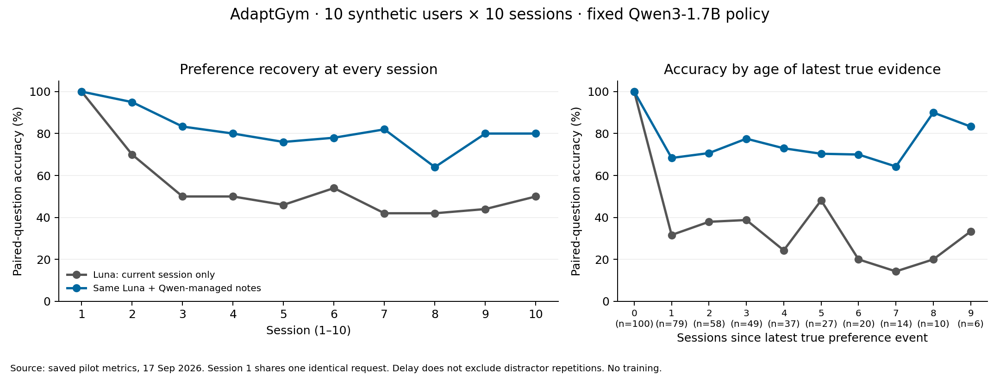

# experiment0.0 — AdaptGym session memory

**Frozen Luna + fixed Qwen3-1.7B notes: 316/400 (79.0%) versus 198/400 (49.5%) without carryover.** Ten synthetic users × ten sessions, evaluated after every session. Memory wins 132 pairs and loses 14. Results are unchanged by this saved-output reanalysis.

Code pin: [`af8e094a662a9e0dbe3a37bec6651ca759f68216`](https://github.com/flavianv/prompt_policy_llm/commit/af8e094a662a9e0dbe3a37bec6651ca759f68216). This commit freezes the executed integration; it was made **after** the experiment. Execution began from repository HEAD `3fe25f3e9215e0e2b0f78d395d85375a7c4a8f1c` plus uncommitted source. The main executed module's SHA-256 is `8f5fcf0dfcd520b07f7a33f6bd7005de5cfe26bafc454a665dcc17e0b5e741bb`; the committed bytes match. The relevant imported source hashes and vendored AdaptGym hashes also match the execution-time manifest. Unrelated dirty MovieLens/Qwen-default edits are **not** attributed to this code commit. The enclosing report commit is separate from the code pin.

This report and its evidence are tracked. [Manifest](manifest.json) records checksums, [cases.json](cases.json) contains exact editorial extracts, and [evidence](evidence) contains all original final-run inputs/outputs. Original ignored run directories remain untouched. [Reproduction instructions](README.md) distinguish offline reanalysis from fresh paid inference.

## What was tested

Each Luna arm receives the same current session and multiple-choice questions about preferences revealed so far. Only the memory arm additionally receives **all prior-session notes**. After both arms are scored, Qwen reads the store, then writes, updates, or finishes with no_op. Its weights are fixed. No evaluation question, answer, hidden profile, provenance truth flag, future event, Luna answer or score is fed to Qwen. Conversations reset each session and notes reset each user. One shared response handles the identical first-session input.

Five preference slots, two distractors/session, update rate 0.35, four choices, 120-word notes, six tool rounds. Luna: low reasoning, 1024 output tokens; Qwen: BF16, greedy non-thinking, 384 tokens per call. Model revision, seeds, complete executed settings and observed context lengths are in [run_config.json](evidence/run_config.json). The API returned the alias `gpt-5.6-luna`, not an immutable dated snapshot; fresh outputs are not numerically deterministic.

## Error taxonomy and counted boundaries

1. **Qwen note-content errors:** omissions, stale preferences, wrong-person facts, irrelevant or duplicate notes. Examples below are editorial cases, not a systematic prevalence estimate. These labels overlap.
2. **Qwen tool-execution/schema errors:** 51 rejected attempts out of 357; 50 wrong write/update existence operations and one extra argument. All 100 sessions eventually reached no_op; there were **zero final-session termination failures**. Recovered schema validity does not establish useful note content. No malformed-answer batch or output-cap event occurred in the final run.
3. **Luna answer errors despite correct supplied notes:** a separate observable failure surface. A wrong answer does not reveal an internal cause; the cycling example below establishes correct evidence availability and incorrect selection only.

Separately, the **initial harness bug** was Python JSON's duplicate-key acceptance. It could silently discard earlier repeated keys. It is not counted as a Qwen error in the final 51 rejected attempts. The initial partial run was stopped, its [source](evidence/initial-harness/source_before_tool_fix.py) and [note traces](evidence/initial-harness/note_traces.jsonl) preserved. The final parser rejects duplicate keys and permits one tool per response. This protocol correction used early pilot traces, so this is an engineering pilot, not an untouched confirmatory test set.

## Reading the cases

All prose session and round numbers below are **one-based**. Raw JSON uses zero-based `session` and `round`; subtract one to locate them. JSONL line references are one-based. Every producer session was scored **before** its displayed note update. A resulting note can affect only later sessions. Each case includes complete session evidence, stores, actual tool calls/results, and the exact answer batch containing the selected question.

### Positive control: correct memory helps

user-17; note-production session 1, evaluation session 2.

The earlier mint-tea note is available; Luna chooses mint tea with notes and green tea without them. This establishes a concrete successful carryover example.

**Producer session evidence (complete):**

- For drink, I prefer mint tea.
- Historical note, not current: I used to prefer history for reading.
- If I were buying for a demo user, late afternoon for workout_time might fit; do not save that as my preference.

**Store before update:**

```json
{}
```

**Actual Qwen calls and dispatcher results:**

Round 1, accepted:

```json
{"tool":"read_notes","arguments":{}}
```

Result: `[{"tool": "read_notes", "notes": {}}]`

Round 2, accepted:

```json
{"tool":"write_note","arguments":{"name":"drink","text":"User prefers mint tea."}}
```

Result: `[{"tool": "write_note", "ok": true, "current_notes": {"drink": "User prefers mint tea."}}]`

Round 3, accepted:

```json
{"tool":"no_op","arguments":{}}
```

Result: `[{"tool": "no_op", "ok": true}]`

**Resulting store:**

```json
{
  "drink": "User prefers mint tea."
}
```

**Evaluation session evidence (complete):**

- The app's compact layout looks nice, but that is not a preference to remember.
- For travel_seat, I prefer front row.
- Riley is different from me: Riley prefers espresso for drink.

**All notes actually supplied to the memory answerer:**

```json
{
  "drink": "User prefers mint tea."
}
```

**Question q0:** What is the user's latest preference for drink?

A: green tea; B: black coffee; C: mint tea; D: espresso.

Truth: **C = mint tea**. Baseline: **A = green tea**. Memory: **C = mint tea**.

Actual baseline API output (entire answer batch):

```json
{"q0":"A","q1":"A"}
```

Actual memory API output (entire answer batch):

```json
{"q0":"C","q1":"A"}
```

Trace references: [producer note line 1](evidence/note_traces.jsonl#L1), [evaluation note line 2](evidence/note_traces.jsonl#L2), [score line 2](evidence/scores.jsonl#L2), [actual baseline request/response line 2](evidence/answer_calls.jsonl#L2), [actual memory request/response line 3](evidence/answer_calls.jsonl#L3).

### Note content: omitted user preference

user-29; note-production session 3, evaluation session 10.

Qwen leaves the explicit extra-legroom statement unsaved and instead attempts to rewrite an existing lunch note. The later memory answer is wrong. Missing evidence and the error coexist; this is not a counterfactual proof that a correct note would force a correct answer.

**Producer session evidence (complete):**

- For travel_seat, I prefer extra legroom.
- The sample itinerary has a short layover, but it is only an example.
- If I were buying for a demo user, tacos for lunch might fit; do not save that as my preference.

**Store before update:**

```json
{
  "notification_style": "end-of-day recap",
  "lunch": "User prefers salads."
}
```

**Actual Qwen calls and dispatcher results:**

Round 1, accepted:

```json
{"tool":"read_notes","arguments":{}}
```

Result: `[{"tool": "read_notes", "notes": {"notification_style": "end-of-day recap", "lunch": "User prefers salads."}}]`

Round 2, rejected:

```json
{"tool":"write_note","arguments":{"name":"lunch","text":"User prefers salads."}}
```

Result: `{"error": "write requires new name; update requires existing name"}`

Round 3, accepted:

```json
{"tool":"no_op","arguments":{}}
```

Result: `[{"tool": "no_op", "ok": true}]`

**Resulting store:**

```json
{
  "notification_style": "end-of-day recap",
  "lunch": "User prefers salads."
}
```

**Evaluation session evidence (complete):**

- The product description mentions only urgent alerts for notification_style, but I am only reading specs.
- If I were buying for a demo user, yoga for exercise might fit; do not save that as my preference.
- I changed my mind about lunch: I now prefer salads instead of sandwiches.

**All notes actually supplied to the memory answerer:**

```json
{
  "notification_style": "User prefers morning summary instead of end-of-day recap.",
  "lunch": "User prefers salads.",
  "exercise": "User prefers cycling."
}
```

**Question q4:** What is the user's latest preference for travel_seat?

A: extra legroom; B: aisle; C: window; D: front row.

Truth: **A = extra legroom**. Baseline: **A = extra legroom**. Memory: **B = aisle**.

Actual baseline API output (entire answer batch):

```json
{"q0":"A","q1":"D","q2":"A","q3":"A","q4":"A"}
```

Actual memory API output (entire answer batch):

```json
{"q0":"A","q1":"D","q2":"B","q3":"B","q4":"B"}
```

Trace references: [producer note line 13](evidence/note_traces.jsonl#L13), [evaluation note line 20](evidence/note_traces.jsonl#L20), [score line 80](evidence/scores.jsonl#L80), [actual baseline request/response line 37](evidence/answer_calls.jsonl#L37), [actual memory request/response line 38](evidence/answer_calls.jsonl#L38).

### Note content: stale preference after explicit change

user-29; note-production session 7, evaluation session 8.

The user explicitly replaces salads with sandwiches, but Qwen changes only notification_style and leaves salads in memory. Next session Luna chooses salads. The stale-note value matches the wrong answer; no internal reasoning or causal certainty is claimed.

**Producer session evidence (complete):**

- Historical note, not current: I used to prefer window for travel_seat.
- I changed my mind about lunch: I now prefer sandwiches instead of salads.
- The weather was surprisingly clear today.

**Store before update:**

```json
{
  "notification_style": "User prefers morning summary instead of end-of-day recap.",
  "lunch": "User prefers salads.",
  "exercise": "User prefers running."
}
```

**Actual Qwen calls and dispatcher results:**

Round 1, accepted:

```json
{"tool":"read_notes","arguments":{}}
```

Result: `[{"tool": "read_notes", "notes": {"notification_style": "User prefers morning summary instead of end-of-day recap.", "lunch": "User prefers salads.", "exercise": "User prefers running."}}]`

Round 2, rejected:

```json
{"tool":"write_note","arguments":{"name":"notification_style","text":"User prefers morning summary instead of end-of-day recap."}}
```

Result: `{"error": "write requires new name; update requires existing name"}`

Round 3, accepted:

```json
{"tool":"update_note","arguments":{"name":"notification_style","text":"User prefers morning summary instead of end-of-day recap."}}
```

Result: `[{"tool": "update_note", "ok": true, "current_notes": {"notification_style": "User prefers morning summary instead of end-of-day recap.", "lunch": "User prefers salads.", "exercise": "User prefers running."}}]`

Round 4, accepted:

```json
{"tool":"no_op","arguments":{}}
```

Result: `[{"tool": "no_op", "ok": true}]`

**Resulting store:**

```json
{
  "notification_style": "User prefers morning summary instead of end-of-day recap.",
  "lunch": "User prefers salads.",
  "exercise": "User prefers running."
}
```

**Evaluation session evidence (complete):**

- The product description mentions science fiction for reading, but I am only reading specs.
- The weather was surprisingly clear today.
- I changed my mind about exercise: I now prefer cycling instead of running.

**All notes actually supplied to the memory answerer:**

```json
{
  "notification_style": "User prefers morning summary instead of end-of-day recap.",
  "lunch": "User prefers salads.",
  "exercise": "User prefers running."
}
```

**Question q1:** What is the user's latest preference for lunch?

A: tacos; B: sandwiches; C: ramen; D: salads.

Truth: **B = sandwiches**. Baseline: **A = tacos**. Memory: **D = salads**.

Actual baseline API output (entire answer batch):

```json
{"q0":"B","q1":"A","q2":"A","q3":"A","q4":"A"}
```

Actual memory API output (entire answer batch):

```json
{"q0":"B","q1":"D","q2":"A","q3":"D","q4":"A"}
```

Trace references: [producer note line 17](evidence/note_traces.jsonl#L17), [evaluation note line 18](evidence/note_traces.jsonl#L18), [score line 67](evidence/scores.jsonl#L67), [actual baseline request/response line 33](evidence/answer_calls.jsonl#L33), [actual memory request/response line 34](evidence/answer_calls.jsonl#L34).

### Note content: another person replaces the user

user-43; note-production session 3, evaluation session 4.

The same session says Sam prefers biographies and the user prefers essays. Qwen stores Sam's fact. Next session Luna chooses biographies. This is both a wrong-person storage error and a downstream answer error, so categories overlap.

**Producer session evidence (complete):**

- Sam is different from me: Sam prefers biographies for reading.
- For reading, I prefer essays.
- Historical note, not current: I used to prefer eggs for breakfast.

**Store before update:**

```json
{
  "reading_preferences": "Jordan prefers mysteries for reading.",
  "coding_music_preferences": "Jordan prefers lo-fi for coding_music.",
  "travel_seat": "User prefers extra legroom."
}
```

**Actual Qwen calls and dispatcher results:**

Round 1, accepted:

```json
{"tool":"read_notes","arguments":{}}
```

Result: `[{"tool": "read_notes", "notes": {"reading_preferences": "Jordan prefers mysteries for reading.", "coding_music_preferences": "Jordan prefers lo-fi for coding_music.", "travel_seat": "User prefers extra legroom."}}]`

Round 2, rejected:

```json
{"tool":"write_note","arguments":{"name":"reading_preferences","text":"Sam prefers biographies for reading."}}
```

Result: `{"error": "write requires new name; update requires existing name"}`

Round 3, accepted:

```json
{"tool":"update_note","arguments":{"name":"reading_preferences","text":"Sam prefers biographies for reading."}}
```

Result: `[{"tool": "update_note", "ok": true, "current_notes": {"reading_preferences": "Sam prefers biographies for reading.", "coding_music_preferences": "Jordan prefers lo-fi for coding_music.", "travel_seat": "User prefers extra legroom."}}]`

Round 4, accepted:

```json
{"tool":"no_op","arguments":{}}
```

Result: `[{"tool": "no_op", "ok": true}]`

**Resulting store:**

```json
{
  "reading_preferences": "Sam prefers biographies for reading.",
  "coding_music_preferences": "Jordan prefers lo-fi for coding_music.",
  "travel_seat": "User prefers extra legroom."
}
```

**Evaluation session evidence (complete):**

- I had a busy morning and moved a few errands around.
- As background only, I previously said I still prefer synthwave for music.
- For music, I prefer synthwave.

**All notes actually supplied to the memory answerer:**

```json
{
  "reading_preferences": "Sam prefers biographies for reading.",
  "coding_music_preferences": "Jordan prefers lo-fi for coding_music.",
  "travel_seat": "User prefers extra legroom."
}
```

**Question q2:** What is the user's latest preference for reading?

A: essays; B: biographies; C: science fiction; D: history.

Truth: **A = essays**. Baseline: **C = science fiction**. Memory: **B = biographies**.

Actual baseline API output (entire answer batch):

```json
{"q0":"A","q1":"D","q2":"C","q3":"D"}
```

Actual memory API output (entire answer batch):

```json
{"q0":"A","q1":"D","q2":"B","q3":"D"}
```

Trace references: [producer note line 23](evidence/note_traces.jsonl#L23), [evaluation note line 24](evidence/note_traces.jsonl#L24), [score line 89](evidence/scores.jsonl#L89), [actual baseline request/response line 44](evidence/answer_calls.jsonl#L44), [actual memory request/response line 45](evidence/answer_calls.jsonl#L45).

### Note content: irrelevant transient detail

user-59; note-production session 8, evaluation session 9.

Qwen adds a possible short walk as work_schedule even though it is not a stable evaluated preference. The following exercise answer is shown for context; no observed exercise error is attributed to this irrelevant note.

**Producer session evidence (complete):**

- The product description mentions oatmeal for breakfast, but I am only reading specs.
- I might take a short walk after work.
- For coding_music, I prefer piano.

**Store before update:**

```json
{
  "breakfast": "User prefers oatmeal.",
  "meeting_style": "User prefers silent docs.",
  "coding_music": "User prefers piano.",
  "music": "User prefers classical.",
  "exercise": "User prefers cycling."
}
```

**Actual Qwen calls and dispatcher results:**

Round 1, accepted:

```json
{"tool":"read_notes","arguments":{}}
```

Result: `[{"tool": "read_notes", "notes": {"breakfast": "User prefers oatmeal.", "meeting_style": "User prefers silent docs.", "coding_music": "User prefers piano.", "music": "User prefers classical.", "exercise": "User prefers cycling."}}]`

Round 2, accepted:

```json
{"tool":"write_note","arguments":{"name":"work_schedule","text":"User might take a short walk after work."}}
```

Result: `[{"tool": "write_note", "ok": true, "current_notes": {"breakfast": "User prefers oatmeal.", "meeting_style": "User prefers silent docs.", "coding_music": "User prefers piano.", "music": "User prefers classical.", "exercise": "User prefers cycling.", "work_schedule": "User might take a short walk after work."}}]`

Round 3, accepted:

```json
{"tool":"no_op","arguments":{}}
```

Result: `[{"tool": "no_op", "ok": true}]`

**Resulting store:**

```json
{
  "breakfast": "User prefers oatmeal.",
  "meeting_style": "User prefers silent docs.",
  "coding_music": "User prefers piano.",
  "music": "User prefers classical.",
  "exercise": "User prefers cycling.",
  "work_schedule": "User might take a short walk after work."
}
```

**Evaluation session evidence (complete):**

- For meeting_style, I prefer silent docs.
- If I were buying for a demo user, toast for breakfast might fit; do not save that as my preference.
- I noticed the quiet lobby music, but I am not choosing a music preference here.

**All notes actually supplied to the memory answerer:**

```json
{
  "breakfast": "User prefers oatmeal.",
  "meeting_style": "User prefers silent docs.",
  "coding_music": "User prefers piano.",
  "music": "User prefers classical.",
  "exercise": "User prefers cycling.",
  "work_schedule": "User might take a short walk after work."
}
```

**Question q2:** What is the user's latest preference for exercise?

A: yoga; B: rowing; C: cycling; D: pilates.

Truth: **C = cycling**. Baseline: **A = yoga**. Memory: **C = cycling**.

Actual baseline API output (entire answer batch):

```json
{"q0":"A","q1":"B","q2":"A","q3":"A","q4":"A"}
```

Actual memory API output (entire answer batch):

```json
{"q0":"B","q1":"C","q2":"C","q3":"A","q4":"A"}
```

Trace references: [producer note line 38](evidence/note_traces.jsonl#L38), [evaluation note line 39](evidence/note_traces.jsonl#L39), [score line 153](evidence/scores.jsonl#L153), [actual baseline request/response line 73](evidence/answer_calls.jsonl#L73), [actual memory request/response line 74](evidence/answer_calls.jsonl#L74).

### Note content: duplicate key and missed update

user-17; note-production session 10, evaluation session 10.

Qwen writes travel while travel_seat already records the identical front-row preference. It also leaves the explicit workout-time change unsaved. The displayed session-10 answer was scored BEFORE this write; there is no session 11, so this trace cannot establish downstream harm from the new duplicate.

**Producer session evidence (complete):**

- The app's compact layout looks nice, but that is not a preference to remember.
- I changed my mind about workout_time: I now prefer lunch break instead of evening.
- Historical note, not current: I used to prefer essays for reading.

**Store before update:**

```json
{
  "drink": "User prefers mint tea.",
  "workout_time": "User prefers evening instead of morning.",
  "reading": "User prefers science fiction.",
  "preferences": "User prefers mint tea, morning workout, and science fiction.",
  "travel_seat": "User prefers front row."
}
```

**Actual Qwen calls and dispatcher results:**

Round 1, accepted:

```json
{"tool":"read_notes","arguments":{}}
```

Result: `[{"tool": "read_notes", "notes": {"drink": "User prefers mint tea.", "workout_time": "User prefers evening instead of morning.", "reading": "User prefers science fiction.", "preferences": "User prefers mint tea, morning workout, and science fiction.", "travel_seat": "User prefers front row."}}]`

Round 2, accepted:

```json
{"tool":"write_note","arguments":{"name":"travel","text":"User prefers front row."}}
```

Result: `[{"tool": "write_note", "ok": true, "current_notes": {"drink": "User prefers mint tea.", "workout_time": "User prefers evening instead of morning.", "reading": "User prefers science fiction.", "preferences": "User prefers mint tea, morning workout, and science fiction.", "travel_seat": "User prefers front row.", "travel": "User prefers front row."}}]`

Round 3, accepted:

```json
{"tool":"no_op","arguments":{}}
```

Result: `[{"tool": "no_op", "ok": true}]`

**Resulting store:**

```json
{
  "drink": "User prefers mint tea.",
  "workout_time": "User prefers evening instead of morning.",
  "reading": "User prefers science fiction.",
  "preferences": "User prefers mint tea, morning workout, and science fiction.",
  "travel_seat": "User prefers front row.",
  "travel": "User prefers front row."
}
```

**Evaluation session evidence (complete):**

- The app's compact layout looks nice, but that is not a preference to remember.
- I changed my mind about workout_time: I now prefer lunch break instead of evening.
- Historical note, not current: I used to prefer essays for reading.

**All notes actually supplied to the memory answerer:**

```json
{
  "drink": "User prefers mint tea.",
  "workout_time": "User prefers evening instead of morning.",
  "reading": "User prefers science fiction.",
  "preferences": "User prefers mint tea, morning workout, and science fiction.",
  "travel_seat": "User prefers front row."
}
```

**Question q3:** What is the user's latest preference for travel_seat?

A: front row; B: window; C: quiet car; D: aisle.

Truth: **A = front row**. Baseline: **B = window**. Memory: **A = front row**.

Actual memory API output (entire answer batch):

```json
{"q0":"D","q1":"A","q2":"B","q3":"A","q4":"B"}
```

Actual baseline API output (entire answer batch):

```json
{"q0":"A","q1":"A","q2":"B","q3":"B","q4":"B"}
```

Trace references: [producer note line 10](evidence/note_traces.jsonl#L10), [evaluation note line 10](evidence/note_traces.jsonl#L10), [score line 39](evidence/scores.jsonl#L39), [actual memory request/response line 18](evidence/answer_calls.jsonl#L18), [actual baseline request/response line 19](evidence/answer_calls.jsonl#L19).

### Tool execution: rejected write followed by valid update

user-29; note-production session 8, evaluation session 9.

write_note against existing exercise is rejected without changing the store. Qwen then issues update_note successfully and finishes. This is a rejected attempt with recovery, not a failed final session. Note-content correctness is a separate check.

**Producer session evidence (complete):**

- The product description mentions science fiction for reading, but I am only reading specs.
- The weather was surprisingly clear today.
- I changed my mind about exercise: I now prefer cycling instead of running.

**Store before update:**

```json
{
  "notification_style": "User prefers morning summary instead of end-of-day recap.",
  "lunch": "User prefers salads.",
  "exercise": "User prefers running."
}
```

**Actual Qwen calls and dispatcher results:**

Round 1, accepted:

```json
{"tool":"read_notes","arguments":{}}
```

Result: `[{"tool": "read_notes", "notes": {"notification_style": "User prefers morning summary instead of end-of-day recap.", "lunch": "User prefers salads.", "exercise": "User prefers running."}}]`

Round 2, rejected:

```json
{"tool":"write_note","arguments":{"name":"exercise","text":"User prefers cycling."}}
```

Result: `{"error": "write requires new name; update requires existing name"}`

Round 3, accepted:

```json
{"tool":"update_note","arguments":{"name":"exercise","text":"User prefers cycling."}}
```

Result: `[{"tool": "update_note", "ok": true, "current_notes": {"notification_style": "User prefers morning summary instead of end-of-day recap.", "lunch": "User prefers salads.", "exercise": "User prefers cycling."}}]`

Round 4, accepted:

```json
{"tool":"no_op","arguments":{}}
```

Result: `[{"tool": "no_op", "ok": true}]`

**Resulting store:**

```json
{
  "notification_style": "User prefers morning summary instead of end-of-day recap.",
  "lunch": "User prefers salads.",
  "exercise": "User prefers cycling."
}
```

**Evaluation session evidence (complete):**

- I changed my mind about reading: I now prefer mysteries instead of history.
- I had a busy morning and moved a few errands around.
- I like the blue label on that package, but it does not change what I prefer.

**All notes actually supplied to the memory answerer:**

```json
{
  "notification_style": "User prefers morning summary instead of end-of-day recap.",
  "lunch": "User prefers salads.",
  "exercise": "User prefers cycling."
}
```

**Question q0:** What is the user's latest preference for exercise?

A: pilates; B: cycling; C: rowing; D: running.

Truth: **B = cycling**. Baseline: **A = pilates**. Memory: **B = cycling**.

Actual baseline API output (entire answer batch):

```json
{"q0":"A","q1":"A","q2":"A","q3":"A","q4":"A"}
```

Actual memory API output (entire answer batch):

```json
{"q0":"B","q1":"A","q2":"B","q3":"A","q4":"C"}
```

Trace references: [producer note line 18](evidence/note_traces.jsonl#L18), [evaluation note line 19](evidence/note_traces.jsonl#L19), [score line 71](evidence/scores.jsonl#L71), [actual baseline request/response line 35](evidence/answer_calls.jsonl#L35), [actual memory request/response line 36](evidence/answer_calls.jsonl#L36).

### Luna answer failure despite correct prior note

user-59; note-production session 7, evaluation session 8.

Before session 8, notes explicitly say the user prefers cycling. Luna still returns q2=A (rowing) rather than B (cycling). The current evidence contains no new exercise preference. This is an observed failure to use correct supplied evidence; the trace does not identify why it happened.

**Producer session evidence (complete):**

- As background only, I previously said I still prefer classical for music.
- Jordan is different from me: Jordan prefers pilates for exercise.
- For exercise, I prefer cycling.

**Store before update:**

```json
{
  "breakfast": "User prefers oatmeal.",
  "meeting_style": "User prefers silent docs.",
  "coding_music": "User prefers piano.",
  "music": "User prefers classical."
}
```

**Actual Qwen calls and dispatcher results:**

Round 1, accepted:

```json
{"tool":"read_notes","arguments":{}}
```

Result: `[{"tool": "read_notes", "notes": {"breakfast": "User prefers oatmeal.", "meeting_style": "User prefers silent docs.", "coding_music": "User prefers piano.", "music": "User prefers classical."}}]`

Round 2, accepted:

```json
{"tool":"write_note","arguments":{"name":"exercise","text":"User prefers cycling."}}
```

Result: `[{"tool": "write_note", "ok": true, "current_notes": {"breakfast": "User prefers oatmeal.", "meeting_style": "User prefers silent docs.", "coding_music": "User prefers piano.", "music": "User prefers classical.", "exercise": "User prefers cycling."}}]`

Round 3, accepted:

```json
{"tool":"no_op","arguments":{}}
```

Result: `[{"tool": "no_op", "ok": true}]`

**Resulting store:**

```json
{
  "breakfast": "User prefers oatmeal.",
  "meeting_style": "User prefers silent docs.",
  "coding_music": "User prefers piano.",
  "music": "User prefers classical.",
  "exercise": "User prefers cycling."
}
```

**Evaluation session evidence (complete):**

- The product description mentions oatmeal for breakfast, but I am only reading specs.
- I might take a short walk after work.
- For coding_music, I prefer piano.

**All notes actually supplied to the memory answerer:**

```json
{
  "breakfast": "User prefers oatmeal.",
  "meeting_style": "User prefers silent docs.",
  "coding_music": "User prefers piano.",
  "music": "User prefers classical.",
  "exercise": "User prefers cycling."
}
```

**Question q2:** What is the user's latest preference for exercise?

A: rowing; B: cycling; C: running; D: yoga.

Truth: **B = cycling**. Baseline: **A = rowing**. Memory: **A = rowing**.

Actual memory API output (entire answer batch):

```json
{"q0":"A","q1":"D","q2":"A","q3":"A","q4":"A"}
```

Actual baseline API output (entire answer batch):

```json
{"q0":"A","q1":"D","q2":"A","q3":"A","q4":"A"}
```

Trace references: [producer note line 37](evidence/note_traces.jsonl#L37), [evaluation note line 38](evidence/note_traces.jsonl#L38), [score line 148](evidence/scores.jsonl#L148), [actual memory request/response line 71](evidence/answer_calls.jsonl#L71), [actual baseline request/response line 72](evidence/answer_calls.jsonl#L72).

### Tool format: extra argument rejected, then removed

user-71; note-production session 1, evaluation session 2.

The read already succeeded. This rejection is specifically the unexpected category argument, despite the generic error message mentioning read/name/text. Removing category produces a valid call. The accepted text still describes Riley, illustrating that schema recovery does not repair wrong-person content.

**Producer session evidence (complete):**

- Riley is different from me: Riley prefers front row for travel_seat.
- For travel_seat, I prefer window.
- I had a busy morning and moved a few errands around.

**Store before update:**

```json
{}
```

**Actual Qwen calls and dispatcher results:**

Round 1, accepted:

```json
{"tool":"read_notes","arguments":{}}
```

Result: `[{"tool": "read_notes", "notes": {}}]`

Round 2, rejected:

```json
{"tool":"write_note","arguments":{"name":"travel_seat","text":"Riley prefers front row.","category":"travel_seat"}}
```

Result: `{"error": "read first; name and text required"}`

Round 3, accepted:

```json
{"tool":"write_note","arguments":{"name":"travel_seat","text":"Riley prefers front row."}}
```

Result: `[{"tool": "write_note", "ok": true, "current_notes": {"travel_seat": "Riley prefers front row."}}]`

Round 4, accepted:

```json
{"tool":"no_op","arguments":{}}
```

Result: `[{"tool": "no_op", "ok": true}]`

**Resulting store:**

```json
{
  "travel_seat": "Riley prefers front row."
}
```

**Evaluation session evidence (complete):**

- The product description mentions weekend only for workout_time, but I am only reading specs.
- For workout_time, I prefer late afternoon.
- I might take a short walk after work.

**All notes actually supplied to the memory answerer:**

```json
{
  "travel_seat": "Riley prefers front row."
}
```

**Question q0:** What is the user's latest preference for travel_seat?

A: extra legroom; B: window; C: quiet car; D: aisle.

Truth: **B = window**. Baseline: **A = extra legroom**. Memory: **A = extra legroom**.

Actual memory API output (entire answer batch):

```json
{"q0":"A","q1":"C"}
```

Actual baseline API output (entire answer batch):

```json
{"q0":"A","q1":"C"}
```

Trace references: [producer note line 41](evidence/note_traces.jsonl#L41), [evaluation note line 42](evidence/note_traces.jsonl#L42), [score line 162](evidence/scores.jsonl#L162), [actual memory request/response line 78](evidence/answer_calls.jsonl#L78), [actual baseline request/response line 79](evidence/answer_calls.jsonl#L79).

## Accuracy, runtime and limitations



Session 1–10 baseline accuracy (%): 100, 70, 50, 50, 46, 54, 42, 42, 44, 50.
Memory accuracy (%): 100, 95, 83.3, 80, 76, 78, 82, 64, 80, 80.
Denominators: 10, 20, 30, 40, then 50 per session. Current-event questions: both 100/100. Earlier-event questions: baseline 98/300 (32.7%), memory 216/300 (72.0%). Repeated distractor text can reveal earlier facts; event delay is not a perfect measure of absence from current text.

190 actual Luna calls completed; 73,464 input and 13,573 output tokens. Estimated final-pilot API cost $0.0309804 at the recorded repository rates, excluding GPU/setup/partial-run costs. Wall time 436.15 s. Qwen: 161,582 input and 5,818 output tokens, 54.46 s generation. All 100 sessions/400 questions pass the independent temporal audit. The final run had no missing answers, malformed answer batches or output-cap events. Raw traces retain every rejected tool attempt.

This measures synthetic stated-preference recovery, not recommendation quality, demographic inference or the advantage of a learned policy over a rule-based memory baseline. No weights were trained. Questions within a user are dependent; editorial error categories overlap and have not been exhaustively counted. Future tasks should add recommendation evaluation without demographic preference stereotypes. Raw output establishes observable behavior, not the model's private reasoning.
